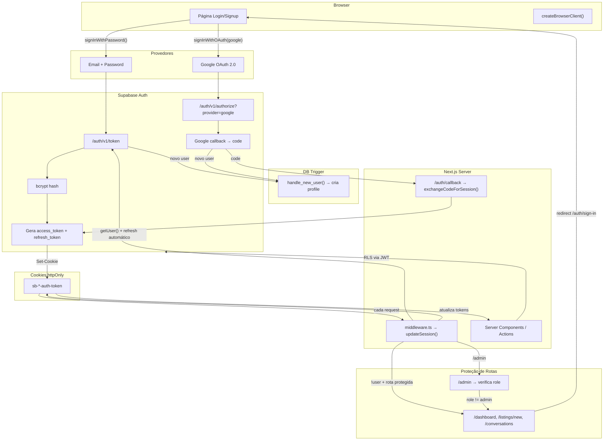
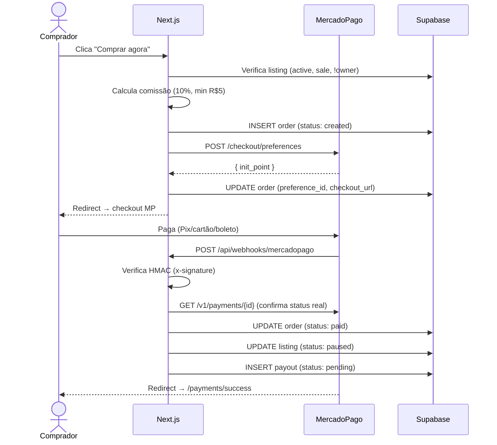

# ShareBooks

Marketplace C2C de livros didáticos usados. Compre, venda ou doe livros escolares na sua comunidade.

## Stack

- **Next.js 14** (App Router) + TypeScript
- **Tailwind CSS** — UI mobile-first
- **Supabase** — Auth, Postgres, Storage, Realtime
- **MercadoPago** — Checkout Pro (Pix, cartão, boleto)

---

## Setup

### 1. Pré-requisitos

- Node.js 18+
- Conta no [Supabase](https://supabase.com) (free tier funciona)
- Conta no [MercadoPago Developers](https://www.mercadopago.com.br/developers/panel) (para pagamentos)

### 2. Clonar e instalar

```bash
git clone <repo-url> sharebooks
cd sharebooks
npm install
```

### 3. Configurar variáveis de ambiente

```bash
cp .env.local.example .env.local
```

Preencha:

```env
# Supabase
NEXT_PUBLIC_SUPABASE_URL=https://xxx.supabase.co
NEXT_PUBLIC_SUPABASE_ANON_KEY=eyJ...
SUPABASE_SERVICE_ROLE_KEY=eyJ...

# App
NEXT_PUBLIC_APP_URL=http://localhost:3000

# MercadoPago
MERCADOPAGO_ACCESS_TOKEN=APP_USR-...
MERCADOPAGO_WEBHOOK_SECRET=...          # opcional em sandbox

# Comissão (padrão: 10%, mínimo R$5)
PAYMENT_FEE_PERCENT=0.10
PAYMENT_MIN_FEE_CENTS=500
```

### 4. Rodar migrations

No **SQL Editor** do Supabase Dashboard, execute na ordem:

| # | Arquivo | Descrição |
|---|---------|-----------|
| 1 | `supabase/migrations/001_initial_schema.sql` | Tabelas, RLS, triggers, storage, realtime |
| 2 | `supabase/migrations/002_increment_views.sql` | Função de incremento de views |
| 3 | `supabase/migrations/003_orders_payouts.sql` | Orders, payouts, comissão (MercadoPago) |
| 4 | `supabase/migrations/004_text_constraints.sql` | Limites de texto no DB (OWASP A05) |

### 5. Configurar Google OAuth (opcional)

1. No [Google Cloud Console](https://console.cloud.google.com), crie um OAuth 2.0 Client ID
2. Authorized redirect URI: `https://<SEU_PROJETO>.supabase.co/auth/v1/callback`
3. No Supabase Dashboard: **Authentication > Providers > Google** → habilitar e colar Client ID + Secret

### 6. Rodar o dev server

```bash
npm run dev
```

Acesse [http://localhost:3000](http://localhost:3000)

### 7. Webhook MercadoPago (dev local)

Para testar pagamentos localmente, use [ngrok](https://ngrok.com):

```bash
ngrok http 3000
```

Configure `NEXT_PUBLIC_APP_URL` com a URL do ngrok. O webhook será `{URL}/api/webhooks/mercadopago`.

### 8. Criar admin

No SQL Editor:

```sql
UPDATE public.profiles SET role = 'admin' WHERE id = 'SEU_USER_ID';
```

---

## Arquitetura

### Estrutura do projeto

```
src/
├── app/
│   ├── (main)/              # Layout com navbar/footer
│   │   ├── page.tsx         # Home
│   │   ├── listings/        # Busca, detalhe, novo, editar
│   │   ├── dashboard/       # Painel do usuário
│   │   ├── conversations/   # Chat realtime
│   │   ├── payments/        # Success, failure, pending
│   │   └── admin/           # Painel admin
│   ├── auth/                # Sign-in, sign-up, callback
│   ├── api/
│   │   ├── messages/        # API de mensagens (rate limited)
│   │   ├── payments/mercadopago/  # Criar preferência MP
│   │   └── webhooks/mercadopago/  # Webhook MP (HMAC)
│   ├── actions/             # Server Actions (listings CRUD)
│   ├── error.tsx            # Error boundary global (OWASP A10)
│   ├── layout.tsx           # Root layout
│   └── globals.css
├── components/
│   ├── ui/                  # Navbar, Footer
│   ├── listings/            # Card, Detail, Form, Filters
│   ├── chat/                # ChatRoom
│   └── admin/               # AdminListings
├── lib/
│   ├── supabase/            # Clients (browser, server, admin, middleware)
│   ├── types/               # Database types
│   ├── mercadopago.ts       # Client MP (fetch puro, sem SDK)
│   ├── security-logger.ts   # Logging estruturado (OWASP A09)
│   ├── rate-limit.ts        # Rate limiting in-memory
│   ├── validation.ts        # Sanitização + validação (OWASP A05)
│   ├── constants.ts
│   └── utils.ts
├── middleware.ts             # Auth + RBAC + session refresh
└── next.config.mjs           # Security headers + CSP
```

### Banco de dados

```
profiles ─────────── 1:N ─── listings ─────── 1:N ─── listing_photos
    │                            │
    │                            ├── 1:N ─── conversations ─── 1:N ─── messages
    │                            │
    │                            └── 1:N ─── orders ─────────── 1:1 ─── payouts
    │
    └── 1:N ─── favorites
```

---

## Fluxo de Autenticação



### Fluxo detalhado

| Etapa | Email/Password | Google OAuth |
|-------|---------------|--------------|
| 1. Início | `signInWithPassword()` | `signInWithOAuth(google)` |
| 2. Validação | Supabase verifica bcrypt | Google consent → retorna `code` |
| 3. Tokens | JWT direto na resposta | `/auth/callback` troca `code` por JWT |
| 4. Storage | Cookies `httpOnly` via `@supabase/ssr` | Idem |
| 5. Profile | Trigger `handle_new_user()` | Idem |

### Refresh de token (automático)

1. Toda request passa pelo `middleware.ts` → `updateSession()`
2. `getUser()` verifica se o `access_token` expirou
3. Se expirou, `@supabase/ssr` usa o `refresh_token` para obter novos tokens
4. Novos tokens gravados nos cookies da response

### Proteção de rotas

| Rota | Regra |
|------|-------|
| `/dashboard`, `/listings/new`, `/conversations` | Requer autenticação |
| `/admin` | Requer `profiles.role = 'admin'` |
| APIs (`/api/*`) | `getUser()` server-side + rate limiting |
| Server Actions | `getUser()` + ownership check |

---

## Fluxo de Pagamento (MercadoPago)



### Modelo de comissão

| Parâmetro | Valor | Env var |
|-----------|-------|---------|
| Taxa padrão | 10% | `PAYMENT_FEE_PERCENT=0.10` |
| Taxa mínima | R$ 5,00 | `PAYMENT_MIN_FEE_CENTS=500` |
| Fórmula | `max(amount * 10%, R$5)` | — |

### Status de order

```
created → pending_payment → paid → completed
                               ↘ canceled
                               ↘ refunded
```

---

## Segurança (OWASP Top 10:2025)

| # | Risco | Proteção implementada |
|---|-------|----------------------|
| A01 | Broken Access Control | RLS em todas as tabelas, Server Actions com auth + ownership check, middleware RBAC |
| A02 | Security Misconfiguration | CSP restritivo (sem `unsafe-eval` em prod), HSTS, X-Frame-Options, Permissions-Policy |
| A03 | Supply Chain Failures | Lockfile fixo, deps declaradas |
| A04 | Cryptographic Failures | bcrypt (Supabase), HSTS, cookies httpOnly |
| A05 | Injection | Sanitização server-side, Supabase parameterized queries, constraints de texto no DB |
| A06 | Insecure Design | RLS, business logic checks, anti-self-purchase |
| A07 | Authentication Failures | Rate limit 5/min, anti-enumeração, password OWASP (10+ chars, upper+lower+number) |
| A08 | Integrity Failures | Webhook HMAC-SHA256, consulta API MP (nunca confia no payload) |
| A09 | Logging Failures | `secLog()` estruturado em todas as rotas críticas, sanitização de PII nos logs |
| A10 | Exceptional Conditions | Error boundary global, mensagens genéricas ao usuário, nunca expõe stack traces |

### Headers de segurança

```
X-Frame-Options: DENY
X-Content-Type-Options: nosniff
Referrer-Policy: strict-origin-when-cross-origin
Strict-Transport-Security: max-age=31536000; includeSubDomains
Permissions-Policy: camera=(), microphone=(), geolocation=()
Content-Security-Policy: default-src 'self'; frame-ancestors 'none'; object-src 'none'; ...
```

### Rate limiting

| Endpoint | Limite | Janela |
|----------|--------|--------|
| Login/Signup | 5 req | 1 min |
| Mensagens | 30 req | 1 min |
| Criar listing | 10 req | 1 hora |
| Checkout | 60 req | 1 min |

> Em produção, substituir rate limit in-memory por Redis/Upstash.

---

## Funcionalidades

### Implementadas

- [x] Cadastro/Login (email + senha)
- [x] Login social (Google OAuth)
- [x] Criar/editar/pausar/reativar anúncio com fotos (1–5)
- [x] Marcar como vendido/doado
- [x] Busca por texto + filtros (escola, serie, estado, preco, local)
- [x] Quick chips de filtro rapido
- [x] Paginacao e ordenacao
- [x] Chat em tempo real (Supabase Realtime)
- [x] Badge de nao lido
- [x] Dashboard com meus anuncios + conversas
- [x] Admin: remover anuncios
- [x] Pagamento via MercadoPago (Pix, cartao, boleto)
- [x] Comissao automatica (10%, min R$5)
- [x] Webhook seguro (HMAC + consulta API)
- [x] Seguranca OWASP Top 10:2025
- [x] UI mobile-first com identidade visual ShareBooks

### Fase 2 (futuro)

- [ ] Split/payout automatico para vendedor
- [ ] Notificacoes push
- [ ] Conversao de imagens para WebP
- [ ] Favoritos com UI
- [ ] Denuncias de anuncio
- [ ] MFA (autenticacao multi-fator)
- [ ] Disputa/reembolso automatizado
- [ ] Confirmacao de entrega na plataforma

---

## Licenca

Projeto privado.
